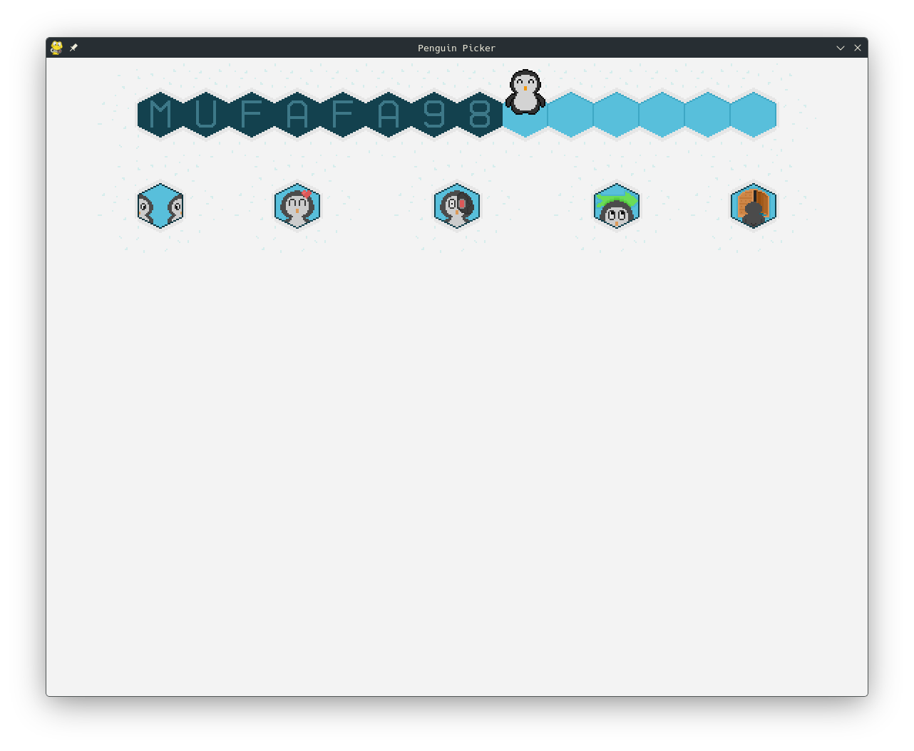
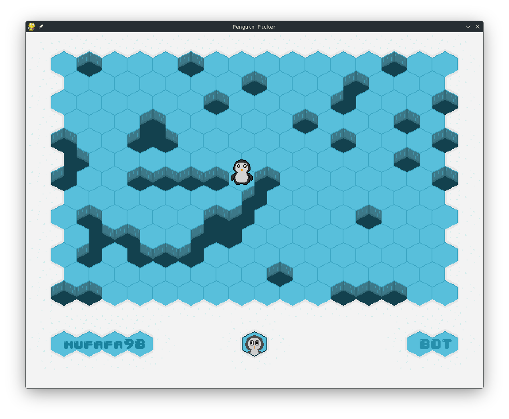
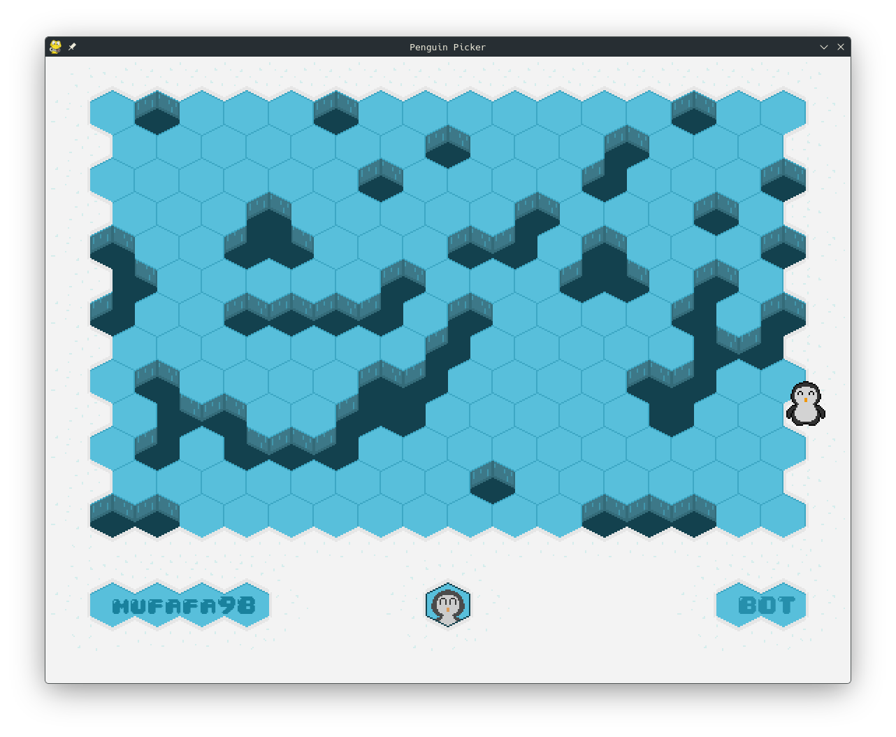
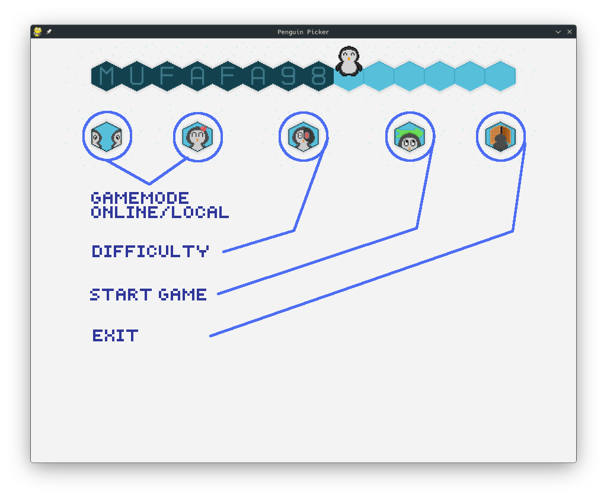
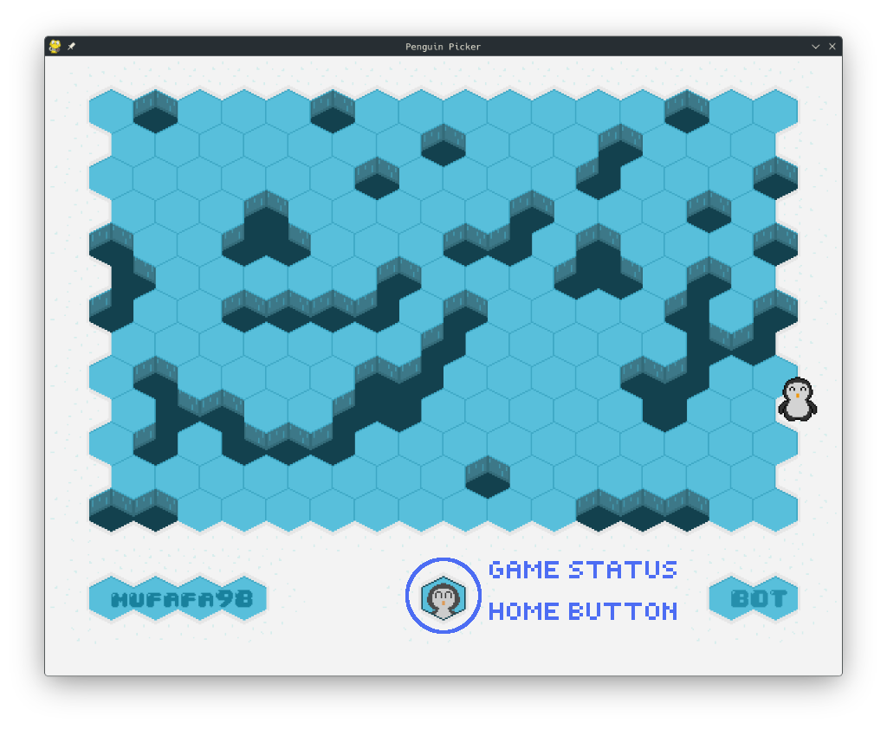
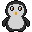

# PenguinPicker

A hexagonal turn‑based strategy game where you control a penguin trying to escape a frozen lake – or play as the cracker who freezes the ice before the penguin can reach the exit.
Play locally against an AI, or challenge a friend online over the network.







## Features

- **Hexagonal** grid board with dynamic ice and snow tiles.

- **Two distinct roles** – play as the **Penguin** (escape) or the **Cracker** (block).

- **Local vs AI** – choose between 3 difficulty levels (Easy, Medium, Hard).

- **Online multiplayer** – connect to the internet and play against another human.

- **Clean GUI** – intuitive menus with custom pixel‑art assets.

## Screenshots & GUI Walkthrough

### Main menu

- Entering the username from the keyboard updates the cursor (the penguin) as you go.

- Toggle between Local and Online Mode

- Select AI difficulty (only available in Local mode).

- Click START to begin.



### The Game

- When playing as the penguin, you can move to adjacent tiles to the penguin and try to reach the snow part of the map while avoiding being trapped by the cracker

- As the cracker, you can place strategic holes in the ice to try and trap the penguin from reaching the snow

### End Game

- The status of your game, victory or loss, is shown in the bottom middle part of the screen

- The icon indicating the game status also acts as the return to home button



## Asset Gallery

All graphics are custom pixel art in a 32×32 base resolution.

- Penguin variants: 




- Player turn indicators: 


- Difficulties from easy to hard: 


The full set is located in the `assets/` directory

## Prerequisites

It is recommended to use  **Python 3.8+** and run the folowing command to install 
dependencies:

```bash
    pip install -r requirements.txt
```

## How to run

1. Clone the repository:
```bash
    git clone https://github.com/Mufafa98/PenguinPicker.git
    cd PenguinPicker
```
2. Start the server (for online mode only)

```bash
    python runner.py -s
```

3. Start the client

```bash
    python runner.py -c
```

- If you chose Local mode, the game starts immediately.
- If you chose Online mode, the client waits for another player to join, and plays
a cute animation.

## How to play 

- Objective (Penguin): Reach a snow (finish) tile before the cracker blocks all your moves.

- Objective (Cracker): Surround the penguin with cracked ice so it has no legal moves.

**Controls**:

- Click on a nearby hexagon to move the penguin or place a wall.

- The current player’s role is shown by the button icon at the bottom (penguin or wall). The penguin is looking to the left or right

- Press the Leave button to return to the main menu.

The turn alternates automatically after each action.

## AI Difficulty Levels

- Easy – random moves (both penguin and cracker).

- Medium – mixes random moves with more strategic plays (70% hard, 30% easy).

- Hard – uses A* pathfinding to either escape (penguin) or block the shortest path (cracker).
